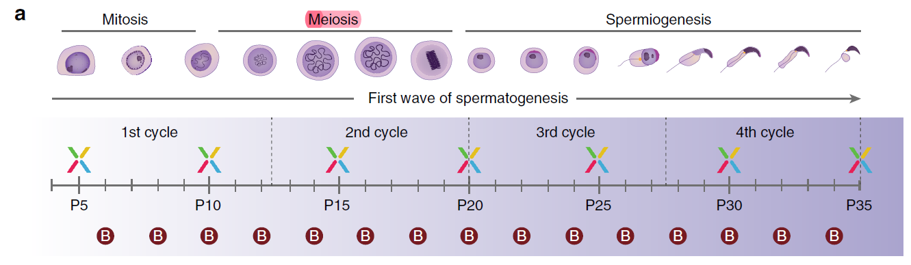
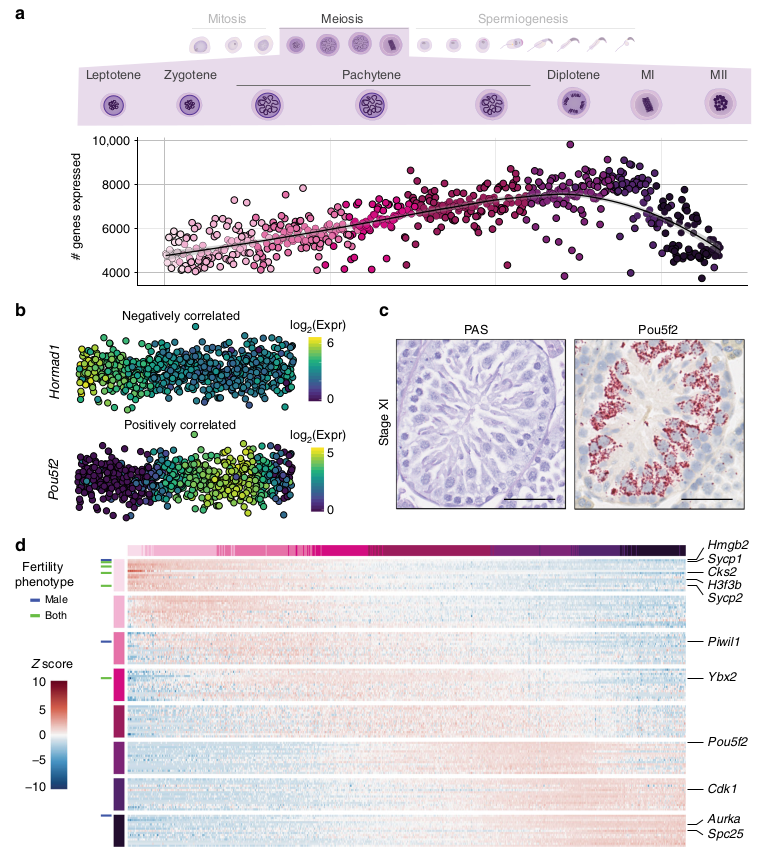
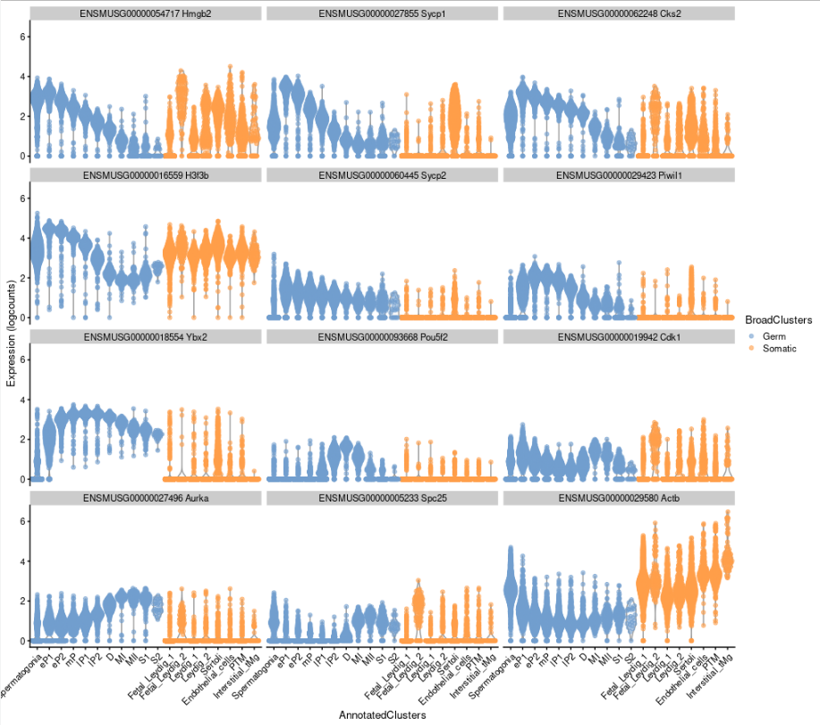
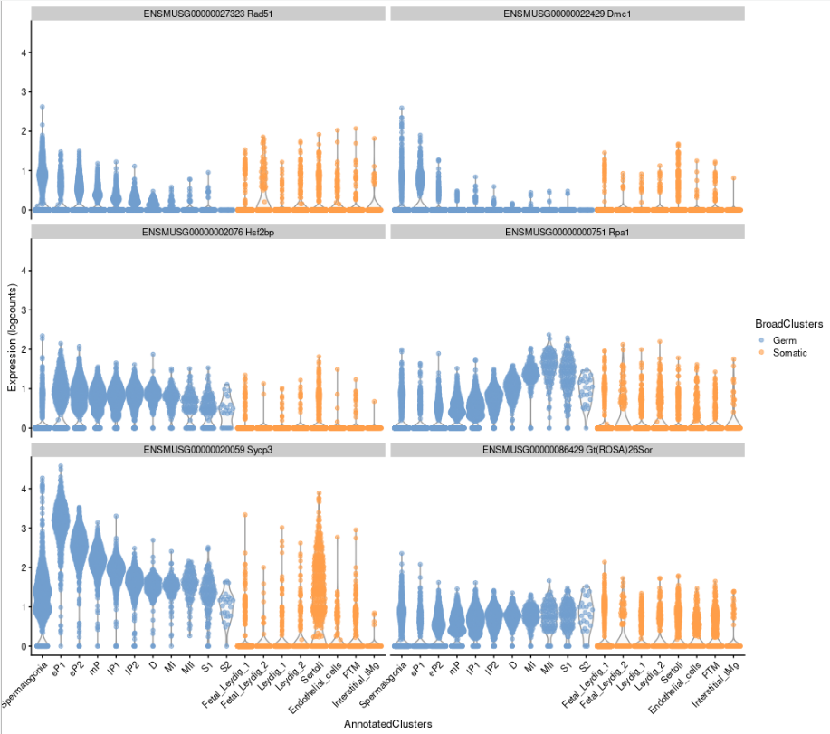
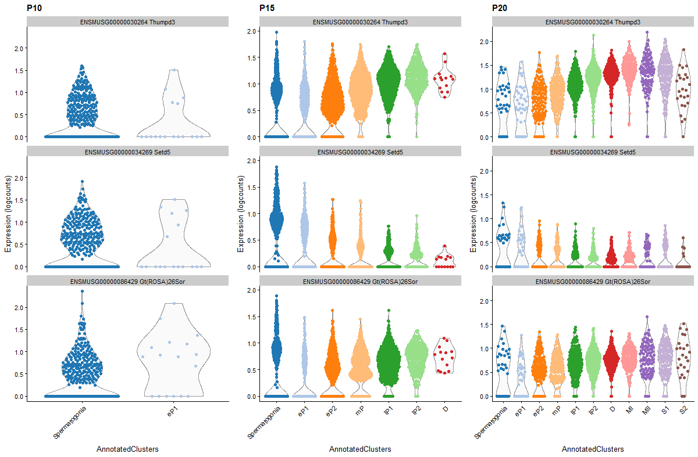

# Ernst et al, 2018
https://doi.org/10.1038/s41467-019-09182-1

---

Datasets:
[E-MTAB-6946](https://www.ebi.ac.uk/arrayexpress/experiments/E-MTAB-6946/) scRNA-Seq: 8 timepoints (P5x2, P10, P15, P25, P30, P35)
[E-MTAB-6934](https://www.ebi.ac.uk/arrayexpress/experiments/E-MTAB-6934/) bulk RNA-Seq: 15 time points (P6, P8, P10, P12, P16, P18, P20, P22, P24, P26, P28, P30, P32 and P34)
Meiosis: P10, 15, 20 

```
#scRNA-Seq (X) or bulk RNA-Seq (B)
```
scRNA-Seq days P10, 15, 20 where chosen for the analysis as they include meiosis stages

---


**Figure 5** (Ernst et al, 2018): Gene expression dynamics during male meiosis. **a** Number of genes expressed per spermatocyte. Cells are ordered by their developmental progression during meiotic prophase until metaphase. **b** Example of genes that are negatively (*Hormad1*) or positively (*Pou5f2*) correlated with the number of genes expressed during meiotic prophase. **c** Representative images for Stage XI tubules from adult animals stained with PAS or RNA ISH for *Pou5f2* using RNAScope. Scale bar represents 50 µm; original magnification ×40. **d** Heatmap visualising the scaled, normalised expression of the top 15 marker genes per cell-type. Row and column labels correspond to the different populations of spermatocytes. Genes are labelled based on their fertility phenotype: blue: infertile or sub-fertile in males, green: infertile or sub-fertile in both males and females.

## Violin plots from the single-cell data using same genes as the ones highlighted in figure 5 d


---
.
.
.
.
.
.
.
.
.
.
.
.
.


# Rosa26 and other expected genes


**Spermatogonia**, **eP**: early-pachytene spermatocyte, **mP**: mid-pachytene SC, **lP**: late-pachytene SC, **D**: diplotene SC, **MI**: meiosis I,
**MII**: meiosis II, **S1-S2**: step 1–11 spermatids
.
.
.
.
.
.
.
.
.


---
# Thumpd3, Setd5 and Rosa26 by stage in germ cells

